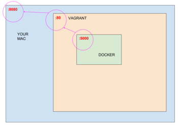

# minbootcamp
> Runbook to get Minh up-to-speed with some DevOps tools 

Who is Minh?
```
Known by many as the Love Doctor.
```

## Overview
1. Spin up a box (VM)
2. Clone some repositories we need inside the box
3. Install tools we need 
4. Dockerize our app
5. Expose our app to the outside world
6. Forward ports to laptop's browser (hosting the VM)
7. Edit our app and create a PR to this repository

### Setup Vagrant
Create a project dir in your desired location
```
$ mkdir minbootcamp
```

Download my image with chef pre-installed
```
$ vagrant box add edmamerto/bento-ubuntu-16.04-chef 
```
 >check it out: [edmamerto/bento-ubuntu-16.04-chef](https://app.vagrantup.com/edmamerto/boxes/bento-ubuntu-16.04-chef)
 
 Our setup should look like this
 
 
 
Create a vagrant file with my image configured in it
```
$ vagrant init edmamerto/bento-ubuntu-16.04-chef 
```
Check if your file was created
```
$ ls
```
Bring up your box 
```
$ vagrant up
```
Login to your box
```
$ vagrant ssh
```
### Download Repos
>Git should be pre-installed in your box

Make sure you're logged-in to your box. Below should return `vagrant`
```bash
$ echo $USER
```

Clone the app 
```
$ git clone https://github.com/edmamerto/handyflasky
```
> check out my repo [github.com/edmamerto/handyflasky](https://github.com/edmamerto/handyflasky)

Check if clone is successful
```
$ ls
```
Clone my chef cookbook which has docker installation recipe. This just makes it easier to install docker, and to get you introduced to chef.
```
$ git clone https://github.com/edmamerto/souschef
```
> check out my repo [github.com/edmamerto/souschef](https://github.com/edmamerto/souschef)

Expected output  when you run `ls` again
```
handyflasky
souschef
```
### Install Docker
Check if chef is installed
```
$ chef
```
Navigate to the chef projdir
```
$ cd souschef
```
Install docker through chef. For now just know that chef can automate what we would have manually done to install Docker like `sudo apt-get install <docker_stuff>`
```
$ sudo chef-client --local-mode --runlist "recipe[docker]"
```
Check if install was successful
```
$ docker
```
By default the docker daemon always runs as the root user. This just means you have to prepend `sudo` all the time when you run docker commands. This can be annoying so let's add your user which is `vagrant` to the docker group. 
```
$ sudo usermod -aG docker $USER
```
For this to take effect. Logout and login of your box
```
$ exit
$ vagrant ssh
```
Check if you're now able to run without `sudo`. You should not get a `permission denied` when you run command below
```
$ docker ps
```
### Build image
Navigate to your app dir
```
$ cd ../handyflasky
```
Print `Dockerfile`. For now just know that this contains config and commands that will bring your app to your desired state when you rin it with docker
```
$ cat Dockerfile
```
Build the image
```
$ docker build -t minbootcamp:latest .
```
Run a container out of the image
```
$ docker run -d -p 5000:5000 minbootcamp
```
Check if container runs
```
$ docker ps
```
Now curl your app and see if returns the Expected Output
```
$ curl 127.0.0.1:5000
```
### Forwarding Ports 
We will be pointing ports from the docker container up to our Laptop so we could access our app from our Laptop's browser.

It will look like this

```
(yourLaptop) 8080 <== (Vagrant) 80 <== (Docker) 5000
```




Exit out of vagrant and configure your `Vagrantfile` ports to listen to `8080 (HOST) 80 (GUEST)`
```
$ exit
```
Configuration will take effect when vagrant is reloaded so do
```
$ vagrant reload
```
Enter vagrant again
```
$ vagrant ssh
```
Create a new instance of your docker app with port fowarded to `80`
```
$ docker run -d -p 80:5000 minbootcamp
```
In your laptop browser go to
```
127.0.0.1:8080
```
You should see a text returned by your app
